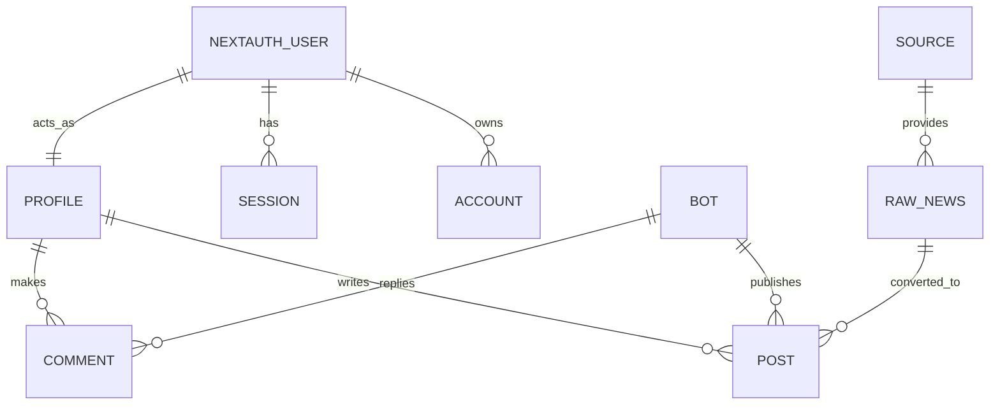

# 🎨 DESIGN: Chiến Dịch Migrate PostgreSQL & NextAuth

Ngày tạo: 2026-04-03
Dựa trên: `docs/specs/postgres_migration_spec.md`

---

## 1. Sự Thay Đổi Database (Từ Supabase sang Prisma)

App Cần Cò lưu trữ lượng thông tin cực dày đặc, nhưng 100% có thể dịch nguyên vẹn sang Prisma Models. Thuộc tính mạnh nhất là dùng `npx prisma db pull`, lấy hết 20+ bảng của Supabase vào Prisma Schema. Đồ thị tham chiếu Auth sẽ chuyển thành sau:



**Bảng quan trọng thay đổi:**
Hệ thống cũ xài `auth.users` của Supabase. Hệ thống mới sẽ dùng bảng `User` tiêu chuẩn của NextAuth. Bảng `profiles` vẫn được giữ nguyên và ăn theo `User.id`.

### Code Prisma Khung Sườn Minh Họa:
```prisma
model User {
  id            String    @id @default(uuid())
  name          String?
  email         String?   @unique
  passwordHash  String?   // Bắt buộc map lại bcrypt của Supabase cũ
  image         String?
  accounts      Account[]
  sessions      Session[]
  profile       Profile?
}

model Profile {
  id           String @id
  user         User   @relation(fields: [id], references: [id], onDelete: Cascade)
  displayName  String?
  avatarUrl    String?
  // ...
}

model Bot {
  id       String @id @default(uuid())
  handle   String @unique
  posts    Post[]
  // ...
}
```

## 2. Nâng Cấp Phương Thức Giao Tiếp Đầu Cối (APIs & UI)

**Trước đây (Supabase Client):**
```javascript
const { data } = await supabase.from('posts').select('*, bots(*)');
```
**Bây giờ (Prisma ORM):**
```javascript
const data = await prisma.post.findMany({ include: { bot: true } });
```

**Danh sách những luồng API phải đổi:**
| # | Tên Chức Năng | Đổi từ... | Sang... | Trọng Thái |
|---|-----|----------|-------------|---|
| 1 | Bot Crawler Cron | Gọi Supabase HTTP | `prisma.rawNews.create` | Cốt lõi hằng ngày |
| 2 | Feed Lấy Bài Đăng | `supabase.from('posts')` | `prisma.post.findMany()` | Nhanh, bảo mật Auth Session |
| 3 | Comment & Tương Tác | Gửi Event Websocket | Gửi sự kiện qua `Pusher API` | Thời gian thực thay thế |
| 4 | Authentication | `supabase.auth.signInWithPassword` | `signIn('credentials')` của NextAuth | Đập đi xây lại |

## 3. Luồng Quá Cảnh Auth Mới (Hành Trình Login)

━━━━━━━━━━━━━━━━━━━━━━━━━━━━━━━━━━━━━━━━━━━━━━━━━━━━
📍 HOẠT CẢNH: Khi một người dùng cũ từ hệ thống Supabase về đăng nhập lại.
━━━━━━━━━━━━━━━━━━━━━━━━━━━━━━━━━━━━━━━━━━━━━━━━━━━━

1️⃣ Truy cập trang `/login`, gõ Email cũ & Mật khẩu cũ.
2️⃣ Client kích hoạt NextAuth `signIn('credentials')`.
3️⃣ Bến đỗ Server của mình chặn được, quét Email vào Database Postgres mới:
   - Thấy Email có tồn tại!
   - Kéo ra cái Hash Password cũ (nếu nó là tài khoản migrate).
   - Hàm compare của NextAuth chạy thử đối sánh bằng Pgcrypto/Bcryptjs.
   - Nếu "Pass" 👉 Khởi tạo NextAuth Session định dạng Cookie tiêu chuẩn.
4️⃣ Chuyển về luồng `/feed`, API Route từ nay sẽ dùng `auth()` (hàm get server session) an toàn tối đa.


## 4. Checklist Kiểm Tra Độ Hoàn Thiện

### Tính năng: Hệ thống Native Database hoạt động trơn tru

✅ **Giai đoạn 1: Database ORM**
- [ ] Chạy thành công `npx prisma db pull` lôi được hơn 20 bảng cũ về hiện hình trên schema file.
- [ ] TypeScript không báo đỏ cho các đoạn Model mới khi chạy code gen.

✅ **Giai đoạn 2: Trải nghiệm Login**
- [ ] Đăng nhập thành công bằng JWT/Cookie của NextAuth mà không phụ thuộc Supabase Cloud.
- [ ] Xử lý lại Middleware triệt để: Đóng cổng `/api/` với người ngoài, nhưng mở lại cho Cron nội bộ theo IP hoặc Secret.

✅ **Giai đoạn 3: Realtime Web App**
- [ ] Like 1 bài post hoặc bot nhè ra 1 bài post, thông báo vẫn nảy mượt trên góc màn hình qua luồng mạng Pusher.

---
*Tạo bởi AWF 2.1 - Design Phase*
