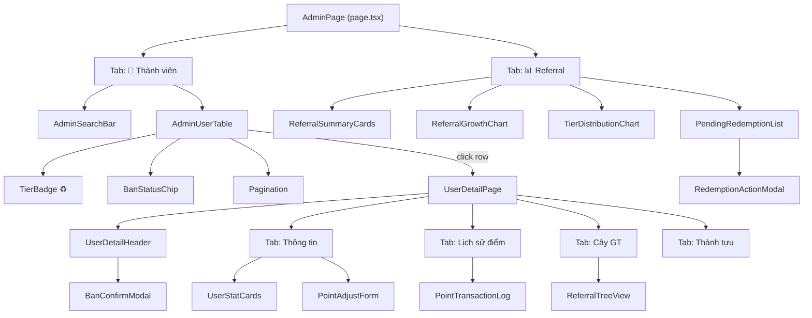

# 🎨 DESIGN: Phase 05 — Admin Gamification Dashboard

Ngày tạo: 2026-04-09
Dựa trên: [phase-05-frontend-admin.md](./phase-05-frontend-admin.md)

---

## 1. Dữ Liệu Đã Có Sẵn (Không cần tạo thêm)

Phase 05 là **Frontend thuần** — tất cả dữ liệu đều đọc/ghi qua API đã sẵn có từ Phase 03.

```
┌──────────────────────────────────────────────────────────────┐
│  💻 TRANG ADMIN (Phase 05 - Frontend)                        │
│                                                              │
│  Chỉ cần GỌI các "cửa" (API) đã mở sẵn:                    │
│                                                              │
│  📋 Danh sách user    ← GET  /api/admin/users                │
│  👤 Chi tiết 1 user   ← GET  /api/admin/users/[id]           │
│  ⚡ Cộng/trừ điểm     ← POST /api/admin/users/[id]/points    │
│  🔴 Khóa tài khoản    ← POST /api/admin/users/[id]/ban       │
│  📊 Thống kê referral ← GET  /api/admin/referrals            │
│  🎁 Đơn đổi quà       ← GET  /api/admin/redemptions          │
│  ✅ Duyệt/từ chối     ← PATCH /api/admin/redemptions/[id]    │
└──────────────────────────────────────────────────────────────┘
```

> 💡 Giống như xây nhà mà đường ống nước, dây điện đã kéo xong rồi.
> Giờ chỉ cần lắp vòi nước, công tắc đèn (giao diện) thôi.

---

## 2. Danh Sách Màn Hình Cần Làm

```
┌────────────────────────────────────────────────────────────────┐
│  TRANG 1: /admin/users — BẢNG QUẢN LÝ THÀNH VIÊN              │
│  Mục đích: Xem tất cả user, lọc theo hạng, tìm kiếm           │
│  Hiển thị: Bảng dữ liệu (tên, email, hạng, điểm, trạng thái) │
│  Thao tác: Tìm kiếm, lọc hạng, phân trang, bấm vào xem chi tiết│
├────────────────────────────────────────────────────────────────┤
│  TRANG 2: /admin/users/[id] — CHI TIẾT 1 USER                  │
│  Mục đích: Xem chi tiết và thao tác trên 1 user cụ thể        │
│  Hiển thị: 4 tab (Thông tin, Lịch sử điểm, Cây GT, Thành tựu)│
│  Thao tác: Cộng/trừ điểm, khóa tài khoản, xem lịch sử        │
├────────────────────────────────────────────────────────────────┤
│  TRANG 3: /admin/referrals — TỔNG QUAN REFERRAL                │
│  Mục đích: Dashboard thống kê toàn hệ thống giới thiệu         │
│  Hiển thị: 4 ô tóm tắt, biểu đồ đường, biểu đồ tròn           │
│  Thao tác: Xem biểu đồ, duyệt/từ chối đơn đổi quà             │
└────────────────────────────────────────────────────────────────┘
```

---

## 3. Thiết Kế Chi Tiết Từng Trang

### 3A. Trang `/admin/users` — Bảng User

```
┌─────────────────────────────────────────────────────────────────────┐
│  👥 QUẢN LÝ THÀNH VIÊN                                    [340 user]│
├─────────────────────────────────────────────────────────────────────┤
│  [🔍 Tìm tên hoặc email...]   [Hạng ▼]   [Trạng thái ▼]          │
├───┬──────────────────┬─────────┬────────┬────────┬──────┬──────────┤
│ # │ Người dùng       │ Hạng    │ Điểm   │ Lượt GT│T.Thái│ Ngày TG  │
├───┼──────────────────┼─────────┼────────┼────────┼──────┼──────────┤
│ 1 │ 🟢 Lê Văn A      │ 💎 K.Cương│ 2,450 │   87  │ ✅   │ 01/01/25 │
│ 2 │ 🟢 Trần Thị B    │ 🥈 Bạch Kim│  980  │   32  │ ✅   │ 15/02/25 │
│ 3 │ 🔴 Nguyễn C      │ 🥉 Đồng   │    0  │    0  │ ❌   │ 20/03/25 │
├───┴──────────────────┴─────────┴────────┴────────┴──────┴──────────┤
│  Trang 1/17           [◀ Trước]  1  2  3 ... 17  [Tiếp ▶]        │
└─────────────────────────────────────────────────────────────────────┘
```

**Mảnh ghép giao diện (Components):**

| Component | Mô tả | Tái sử dụng? |
|-----------|--------|:---:|
| `AdminUserTable` | Bảng chính, có sort + row click | Mới |
| `AdminSearchBar` | Ô tìm kiếm + 2 dropdown lọc | Mới |
| `TierBadge` | Badge hạng (💎🥇🥈🥉🏅) | ✅ Có sẵn trong referral |
| `BanStatusChip` | Chip xanh "Hoạt động" / đỏ "Bị khóa" | Mới |
| `Pagination` | Thanh phân trang | Mới |

**Cách hoạt động:**
1. Mở trang → Gọi `GET /api/admin/users?page=1&limit=20`
2. Gõ ô tìm kiếm → Gọi lại API với `?search=...` (debounce 300ms)
3. Chọn dropdown Hạng → Gọi lại API với `?tier=3`
4. Bấm vào 1 dòng → Chuyển sang `/admin/users/[id]`

---

### 3B. Trang `/admin/users/[id]` — Chi Tiết User

```
┌─────────────────────────────────────────────────────────────────────┐
│  ← Quay lại danh sách                                              │
│                                                                     │
│  [Avatar]  LÊ VĂN A                                                │
│  leva@mail.com  •  💎 Kim Cương  •  87 lượt GT  •  TG: 01/01/2025 │
│                                              [🔴 Khóa tài khoản]   │
├─────────────────────────────────────────────────────────────────────┤
│  [📋 Thông tin]  [📜 Lịch sử điểm]  [🌳 Cây GT]  [🏆 Thành tựu]  │
├─────────────────────────────────────────────────────────────────────┤
│                                                                     │
│  ══════ TAB 1: THÔNG TIN ══════                                     │
│                                                                     │
│  ┌──────────┐  ┌──────────┐  ┌──────────┐  ┌──────────┐           │
│  │   2,450  │  │   3,200  │  │     750  │  │     600  │           │
│  │ Điểm H.Tại│  │ Đã Kiếm │  │ Đã Tiêu │  │ Điểm GT  │           │
│  └──────────┘  └──────────┘  └──────────┘  └──────────┘           │
│                                                                     │
│  ┌─────────────────────────────────────────────┐                    │
│  │ ⚡ ĐIỀU CHỈNH ĐIỂM THỦ CÔNG                │                    │
│  │ Số điểm: [    +100   ]                      │                    │
│  │ Lý do:   [Thưởng sự kiện tháng 4          ] │                    │
│  │                              [💾 Áp dụng]   │                    │
│  └─────────────────────────────────────────────┘                    │
│                                                                     │
│  ══════ TAB 2: LỊCH SỬ ĐIỂM ══════                                 │
│                                                                     │
│  🟢 +20  referral   Giới thiệu Trần B          2 ngày trước       │
│  🔴 -50  boost      Đẩy bài "Cho thuê Q1"      5 ngày trước       │
│  🟢 +20  referral   Giới thiệu Nguyễn C        1 tuần trước       │
│  🟡 +100 manual     [Admin] Thưởng sự kiện     2 tuần trước       │
│                                                                     │
│  ══════ TAB 3: CÂY GIỚI THIỆU ══════                               │
│                                                                     │
│  👆 Được giới thiệu bởi: [Av] Phạm D                               │
│  👇 Đã giới thiệu (87 người):                                      │
│     [Av] Trần B  [Av] Nguyễn C  [Av] Lê D  [+ 84 người khác]     │
│                                                                     │
│  ══════ TAB 4: THÀNH TỰU ══════                                     │
│                                                                     │
│  🏅 Người giới thiệu đầu tiên     Mở khóa: 15/01/2025             │
│  🏅 10 lượt giới thiệu             Mở khóa: 20/02/2025             │
└─────────────────────────────────────────────────────────────────────┘
```

**Mảnh ghép giao diện (Components):**

| Component | Mô tả | File |
|-----------|--------|------|
| `UserDetailHeader` | Avatar + tên + tier + nút ban | `components/admin/UserDetailHeader.tsx` |
| `UserStatCards` | 4 ô điểm (H.Tại, Kiếm, Tiêu, GT) | `components/admin/UserStatCards.tsx` |
| `PointAdjustForm` | Form cộng/trừ điểm thủ công | `components/admin/PointAdjustForm.tsx` |
| `PointTransactionLog` | Bảng lịch sử điểm với màu sắc | `components/admin/PointTransactionLog.tsx` |
| `ReferralTreeView` | Cây người giới thiệu | `components/admin/ReferralTreeView.tsx` |
| `BanConfirmModal` | Modal xác nhận khóa + nhập lý do | `components/admin/BanConfirmModal.tsx` |

**Màu sắc lịch sử điểm:**
- 🟢 Xanh lá = cộng điểm (referral, manual cộng)
- 🔴 Đỏ = trừ điểm (boost, redeem, manual trừ)
- 🟡 Vàng = thao tác admin (manual)
- 🔵 Xanh dương = hoàn điểm (refund)

---

### 3C. Trang `/admin/referrals` — Dashboard Referral

```
┌─────────────────────────────────────────────────────────────────────┐
│  📊 TỔNG QUAN REFERRAL                                              │
├──────────────┬──────────────┬──────────────┬────────────────────────┤
│   12 lượt    │  234 lượt    │ 1,892 lượt   │  💎 3 user Kim Cương   │
│   Hôm nay    │  Tháng này   │  Tổng cộng   │   VIP cao nhất        │
├──────────────┴──────────────┴──────────────┴────────────────────────┤
│                                                                     │
│  ┌── 📈 TĂNG TRƯỞNG 30 NGÀY ──┐  ┌── 💎 PHÂN BỐ HẠNG ──────────┐ │
│  │                              │  │                              │ │
│  │   ╱╲      ╱╲                │  │     ████ Đồng: 193 (56.8%)  │ │
│  │  ╱  ╲    ╱  ╲     ╱╲       │  │     ███  Bạc:   87 (25.6%)  │ │
│  │ ╱    ╲──╱    ╲───╱  ╲      │  │     ██   Vàng:  45 (13.2%)  │ │
│  │╱                     ╲     │  │     █    B.Kim: 12  (3.5%)   │ │
│  │                              │  │     ▪    K.Cương: 3 (0.9%)  │ │
│  │  01/03  ──────────  09/04   │  │                              │ │
│  └──────────────────────────────┘  └──────────────────────────────┘ │
│                                                                     │
├─────────────────────────────────────────────────────────────────────┤
│  🎁 ĐƠN ĐỔI QUÀ CHỜ DUYỆT (5 đơn)                                │
├──────────────────┬───────────────┬────────┬─────────────────────────┤
│ [Av] Lê A        │ Thẻ cào 50k  │ 100 đ  │  [✅ Duyệt] [❌ Từ chối]│
│ [Av] Trần B      │ Voucher Grab │ 200 đ  │  [✅ Duyệt] [❌ Từ chối]│
│ [Av] Nguyễn C    │ Thẻ cào 100k │ 180 đ  │  [✅ Duyệt] [❌ Từ chối]│
└──────────────────┴───────────────┴────────┴─────────────────────────┘
```

**Mảnh ghép giao diện (Components):**

| Component | Mô tả | File |
|-----------|--------|------|
| `ReferralSummaryCards` | 4 ô thống kê nhanh | `components/admin/ReferralSummaryCards.tsx` |
| `ReferralGrowthChart` | Biểu đồ đường 30 ngày | `components/admin/ReferralGrowthChart.tsx` |
| `TierDistributionChart` | Biểu đồ tròn phân bố hạng | `components/admin/TierDistributionChart.tsx` |
| `PendingRedemptionList` | Danh sách đơn chờ duyệt | `components/admin/PendingRedemptionList.tsx` |
| `RedemptionActionModal` | Modal xác nhận duyệt/từ chối | `components/admin/RedemptionActionModal.tsx` |

**Thư viện biểu đồ:** Cài thêm `recharts` (nhẹ, phổ biến, tương thích React 19).

---

## 4. Luồng Hoạt Động (Admin Journey)

```
━━━━━━━━━━━━━━━━━━━━━━━━━━━━━━━━━━━━━━━━━━━━━━━━━━━━━━━━━
📍 HÀNH TRÌNH 1: Admin kiểm tra thành viên
━━━━━━━━━━━━━━━━━━━━━━━━━━━━━━━━━━━━━━━━━━━━━━━━━━━━━━━━━

1️⃣  Vào trang /admin → Bấm tab "👥 Thành viên"
2️⃣  Thấy bảng danh sách 340 user
3️⃣  Gõ tên "Lê Văn A" vào ô tìm kiếm → Bảng lọc tức thì
4️⃣  Bấm vào dòng Lê Văn A → Qua trang chi tiết
5️⃣  Xem điểm, lịch sử, cây giới thiệu
6️⃣  Cộng 100 điểm thưởng → Nhập lý do → Bấm Áp dụng
7️⃣  Thấy điểm cập nhật ngay trên màn hình

━━━━━━━━━━━━━━━━━━━━━━━━━━━━━━━━━━━━━━━━━━━━━━━━━━━━━━━━━
📍 HÀNH TRÌNH 2: Admin duyệt đơn đổi quà
━━━━━━━━━━━━━━━━━━━━━━━━━━━━━━━━━━━━━━━━━━━━━━━━━━━━━━━━━

1️⃣  Vào /admin → Bấm tab "📊 Referral"
2️⃣  Cuộn xuống phần "Đơn chờ duyệt"
3️⃣  Thấy 5 đơn đang pending
4️⃣  Bấm ✅ Duyệt → Hiện modal xác nhận → Ghi chú (nếu muốn) → OK
5️⃣  Đơn biến mất khỏi danh sách chờ
6️⃣  Hoặc bấm ❌ Từ chối → Nhập lý do → OK → Điểm hoàn lại tự động

━━━━━━━━━━━━━━━━━━━━━━━━━━━━━━━━━━━━━━━━━━━━━━━━━━━━━━━━━
📍 HÀNH TRÌNH 3: Admin khóa tài khoản vi phạm
━━━━━━━━━━━━━━━━━━━━━━━━━━━━━━━━━━━━━━━━━━━━━━━━━━━━━━━━━

1️⃣  Từ bảng user, lọc theo "Trạng thái: Hoạt động"
2️⃣  Bấm vào user vi phạm
3️⃣  Bấm nút 🔴 "Khóa tài khoản"
4️⃣  Modal hiện lên → Nhập lý do (bắt buộc ≥ 5 ký tự) → Xác nhận
5️⃣  Trạng thái user chuyển sang "Bị khóa", ghi audit trail
```

---

## 5. Điều Hướng (Navigation)

Tích hợp vào trang Admin hiện có (`/admin/page.tsx`) bằng cách **thêm 2 tab mới**:

```
Hiện tại:  [📈 Báo Cáo KPI] [⚙️ Vận Hành] [👨‍💼 Nhân Sự Bot] [🌐 Nguồn Cào] [⚙️ Lõi HT]

Sau khi thêm:
           [📈 KPI] [⚙️ VH] [👨‍💼 Bot] [🌐 Cào] [⚙️ Lõi] [👥 Thành viên] [📊 Referral]
```

**Lý do dùng tab thay vì trang riêng:**
- Admin page hiện tại đã dùng pattern tab → Giữ nhất quán
- Không cần tạo layout riêng cho `(admin)` route group
- Đơn giản hơn, tốn ít code hơn

**Ngoại lệ:** Trang chi tiết user `/admin/users/[id]` là **trang riêng** vì nội dung quá dài để nhét trong tab.

---

## 6. Sơ Đồ Component



---

## 7. File Map (Danh sách file cần tạo/sửa)

### Tệp Mới (NEW):

| # | File | Loại |
|---|------|------|
| 1 | `app/admin/components/AdminUsersTab.tsx` | Tab thành viên (bảng + search) |
| 2 | `app/admin/components/AdminReferralTab.tsx` | Tab referral dashboard |
| 3 | `app/admin/users/[id]/page.tsx` | Trang chi tiết user |
| 4 | `components/admin/UserDetailHeader.tsx` | Header user + nút ban |
| 5 | `components/admin/UserStatCards.tsx` | 4 ô thống kê điểm |
| 6 | `components/admin/PointAdjustForm.tsx` | Form cộng/trừ điểm |
| 7 | `components/admin/PointTransactionLog.tsx` | Bảng lịch sử (có màu) |
| 8 | `components/admin/ReferralTreeView.tsx` | Cây giới thiệu |
| 9 | `components/admin/BanConfirmModal.tsx` | Modal khóa tài khoản |
| 10 | `components/admin/ReferralSummaryCards.tsx` | 4 ô tóm tắt referral |
| 11 | `components/admin/ReferralGrowthChart.tsx` | Biểu đồ đường |
| 12 | `components/admin/TierDistributionChart.tsx` | Biểu đồ tròn |
| 13 | `components/admin/PendingRedemptionList.tsx` | Đơn chờ duyệt |
| 14 | `components/admin/RedemptionActionModal.tsx` | Modal duyệt/từ chối |
| 15 | `styles/admin.module.css` | CSS riêng cho admin |

### Tệp Sửa (MODIFY):

| # | File | Thay đổi |
|---|------|----------|
| 1 | `app/admin/page.tsx` | Thêm 2 tab mới (Thành viên + Referral) |
| 2 | `package.json` | Cài thêm `recharts` cho biểu đồ |

**Tổng: 15 file mới + 2 file sửa**

---

## 8. Quy Ước Kỹ Thuật

### Styling
- Dùng **`wm-*` classes** từ globals.css (bảng, badge, panel, input)
- Dùng **Tailwind** cho layout (flex, grid, spacing)
- CSS Module `admin.module.css` cho các style riêng biệt

### State Management
- `useState` + `useEffect` cho fetch data
- `useCallback` cho debounce search
- Không cần state manager phức tạp (data luôn fresh từ API)

### Loading & Error
- Skeleton loading khi fetch lần đầu
- Toast notification khi cộng/trừ điểm, duyệt đơn
- Error boundary cho biểu đồ (fallback nếu recharts lỗi)

---

## 9. Checklist Kiểm Tra (Acceptance Criteria)

### Trang Danh sách User
- [ ] Hiển thị đúng danh sách user với phân trang
- [ ] Tìm kiếm theo tên/email hoạt động (debounce 300ms)
- [ ] Lọc theo Hạng (1-5) hoạt động
- [ ] Lọc theo trạng thái (Hoạt động / Bị khóa) hoạt động
- [ ] Bấm vào dòng → chuyển sang trang chi tiết
- [ ] Badge hạng hiển thị đúng emoji + màu

### Trang Chi tiết User
- [ ] Header hiển thị đúng thông tin user (tên, email, hạng, ngày TG)
- [ ] 4 tab chuyển đổi mượt mà
- [ ] Tab Thông tin: 4 ô điểm hiển thị đúng số
- [ ] Form cộng điểm: nhập 50, lý do "Thưởng SK" → thành công, số cập nhật ngay
- [ ] Form trừ điểm: trừ quá số dư → hiện lỗi "Không đủ điểm"
- [ ] Validation lý do: thiếu hoặc < 5 ký tự → hiện lỗi
- [ ] Tab Lịch sử: cộng = xanh, trừ = đỏ, admin = vàng
- [ ] Tab Cây GT: hiển thị người giới thiệu + danh sách đã GT
- [ ] Nút Khóa tài khoản → modal xác nhận → trạng thái chuyển

### Trang Dashboard Referral
- [ ] 4 ô tóm tắt (Hôm nay, Tháng này, Tổng, VIP) hiển thị số đúng
- [ ] Biểu đồ đường 30 ngày render không lỗi
- [ ] Biểu đồ tròn 5 hạng hiển thị đúng %
- [ ] Đơn đổi quà pending hiển thị đúng
- [ ] Bấm Duyệt → modal → xác nhận → đơn biến mất khỏi danh sách
- [ ] Bấm Từ chối → modal (bắt buộc lý do) → điểm hoàn lại

---

## 10. Test Cases (Cho `/test` workflow)

### TC-01: Tìm kiếm user
```
Given: Admin đang ở tab Thành viên, có 340 user
When:  Gõ "test@admin" vào ô tìm kiếm
Then:  ✓ Bảng lọc chỉ còn user có email chứa "test@admin"
       ✓ Debounce 300ms (không gọi API mỗi phím bấm)
       ✓ Xóa trắng ô tìm → về lại danh sách đầy đủ
```

### TC-02: Cộng điểm thủ công
```
Given: Admin đang ở trang chi tiết user A, điểm hiện tại = 100
When:  Nhập +50, lý do "Thưởng quý 1 năm 2026", bấm Áp dụng
Then:  ✓ Toast thông báo "Đã cộng 50 điểm thành công"
       ✓ Ô "Điểm hiện tại" cập nhật = 150
       ✓ Tab Lịch sử có dòng mới "[Admin] Thưởng quý 1..."
```

### TC-03: Trừ điểm quá số dư
```
Given: User B có 30 điểm
When:  Admin nhập -100, lý do "Trừ phạt vi phạm", bấm Áp dụng
Then:  ✓ Hiện lỗi "Số điểm không đủ. User hiện có 30 điểm..."
       ✓ Không thay đổi điểm
```

### TC-04: Khóa tài khoản
```
Given: User C đang ở trạng thái "Hoạt động"
When:  Admin bấm "Khóa tài khoản" → modal hiện → nhập lý do "Spam"
Then:  ✓ Lỗi: "Phải cung cấp lý do ít nhất 5 ký tự"
When:  Sửa thành "Spam bài viết quá nhiều" → bấm Xác nhận
Then:  ✓ Trạng thái chuyển "Bị khóa"
       ✓ Nút đổi thành "Mở khóa tài khoản"
```

### TC-05: Duyệt đơn đổi quà
```
Given: Có 5 đơn PENDING trên dashboard
When:  Admin bấm ✅ Duyệt đơn của Lê A "Thẻ cào 50k"
Then:  ✓ Modal xác nhận hiện
       ✓ Bấm OK → đơn biến khỏi danh sách pending
       ✓ Đếm còn "4 đơn chờ duyệt"
```

### TC-06: Từ chối đơn → hoàn điểm
```
Given: User D có 200 điểm, đã đổi voucher 100 điểm (PENDING)
When:  Admin bấm ❌ Từ chối → nhập "Hết hàng" → OK
Then:  ✓ Đơn biến khỏi danh sách
       ✓ Điểm user D tăng lại thành 300 (200 + 100 hoàn)
```

---

## 11. Dependency Cần Cài

```bash
npm install recharts
```

> `recharts` là thư viện biểu đồ React phổ biến nhất, nhẹ (~45KB gzip),
> hỗ trợ SSR và tương thích React 19.

---

*Tạo bởi AWF 2.1 - Design Phase | 2026-04-09*
